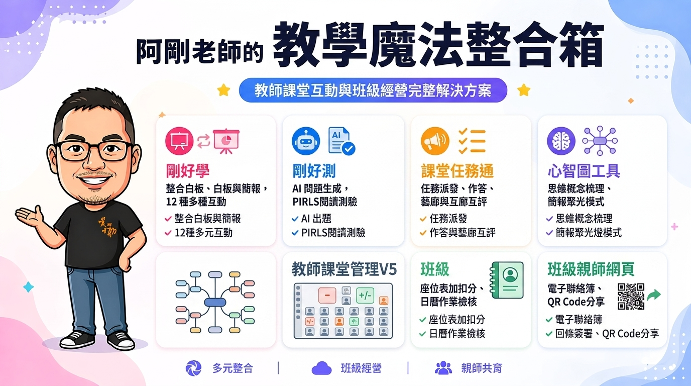

# 阿剛老師的教學魔法整合箱 🧰✨
> **課堂即時互動 ✕ AI 評量測驗 ✕ 學習任務 ✕ 思維心智圖 ✕ 班級親師經營**  
> *跳脫商業平台的付費限制與繁瑣設定，直擊課堂教學與班級經營的真實核心需求！*

---



## 📖 專案簡介

本專案由 **阿剛老師** 專為第一線教師設計開發，旨在打造一套**零主機伺服器費用**、**免安裝任何 App**、**跨載具直覺好用**的完整教學與班級經營生態系統。

透過結合 **Google Firebase 即時資料庫**（多端秒級同步）與 **Google Apps Script (GAS) 試算表技術**（以老師自己的 Google 試算表作為資料庫，資料安全透明自主管理），讓全班師生與家長皆能透過網頁或 QR Code 輕鬆連線互動！

---

## 🚀 整合工具分類與功能導覽

### 🔴 第一類別：課堂即時互動與測驗系列 (Firebase 即時雲端)

#### 1. 剛好學 (ClassTools)
- **核心定位**：全能型課堂活動中心，已完整內嵌整合**剛好白板**與**剛好簡報**，免切換頁面一站搞定。
- **主要功能**：
  - **12種多元題型**：是非、選擇、繪圖、錄音、文字雲、便利貼牆、AI 智慧試題生成、全班搶答、專注力檢測與同儕互評。
  - **內建剛好白板**：多人即時共用畫布、便利貼協作、支援 PDF/圖片背景插入，小組共創最佳利器。
  - **內建剛好簡報**：教師端切換投影片，學生裝置零時差同步跟隨；隨插即用即時問答與作答預覽。
- **存取檔案**：[`01classtools.html`](01classtools.html)

#### 2. 剛好測 (ClassQuiz)
- **核心定位**：AI 賦能的專業課堂測驗系統，出題、即時批改與成績分析一次搞定。
- **主要功能**：
  - **AI 智慧教材出題**：支援從 PDF、圖片或文字教材一鍵智慧生成各類是非與選擇試題。
  - **PIRLS 層次閱讀測驗**：專為長文閱讀理解設計，支援學生端即時螢光筆畫記作答與思維歷程回放。
  - **即時診斷儀表板**：答題正確率統計、試題鑑別度分析與 CSV 詳細成績報表一鍵匯出。
- **存取檔案**：[`04classquiz.html`](04classquiz.html)

---

### 🔵 第二類別：課堂任務管理與作品展示 (GAS 試算表架構)

#### 3. 剛好系列 - 課堂任務通
- **核心定位**：模組化課堂任務派發、作答繳交、同儕互評與作品藝廊展示系統。
- **主要功能**：
  - **多元任務類型**：支援問答題、繪圖手寫、錄音發音、PDF 閱讀劃線筆記。
  - **作品藝廊與互評**：即時大螢幕展示牆，全班學生可互相觀摩作品、點讚給星與留言心得。
  - **進度檢核與退回**：支援教師線上批改退回訂正，學生使用課堂代碼免註冊隨開即用。
- **詳細教學與工具連結**：[課堂任務通詳細說明](https://kentxchang.blogspot.com/2026/07/google.html)

---

### 🟢 第三類別：思維構思與心智圖工具 (GAS 雲端儲存)

#### 4. 剛好系列 - 心智圖工具
- **核心定位**：結構化思考、課堂概念梳理、支援多媒體節點的心智圖編輯工具。
- **主要功能**：
  - **極速結構編輯**：支援鍵盤快捷鍵、子節點/同級節點快速新增、拖曳重排層級。
  - **多媒體節點**：節點可嵌入超連結、圖片與詳細富文本筆記。
  - **雙向匯入匯出**：支援 Markdown 大綱雙向轉換、SVG/PNG 向量圖檔下載。
  - **簡報聚光燈模式**：一鍵開啟全螢幕模式，節點由淺入深逐層展開聚焦講述。
- **詳細教學與工具連結**：[心智圖工具詳細說明](https://kentxchang.blogspot.com/2026/07/gas.html)

---

### 🟣 第四類別：班級經營與親師互動 (GAS 試算表架構)

#### 5. 教師課堂管理整合工具 V5
- **核心定位**：日曆式課堂中樞：整合座位表、加扣分獎勵、作業檢核與電子聯絡簿。
- **主要功能**：
  - **互動座位表**：直覺拖拉排座位，支援個人與分組一鍵加扣分與正向激勵。
  - **每日作業檢核**：五色燈號快速追蹤（未交、已交、待訂正、已訂正、未開始）。
  - **大螢幕聯絡簿**：一鍵投影全螢幕聯絡簿供學生抄寫，支援 PDF 匯出列印。
  - **日曆式課堂管理**：直覺管理每日行事曆、教學進度與學生課堂表現紀錄。
- **詳細教學與工具連結**：[教師課堂管理工具V5詳細說明](https://kentxchang.blogspot.com/2026/07/v5gashtml.html)

#### 6. 班級親師網頁系統 (+QRCode)
- **核心定位**：存放在老師自己 Google 試算表的親師交流網頁，免外部資料庫、個資安全自主。
- **主要功能**：
  - **親師通訊整合**：每日電子聯絡簿、班級公告、榮譽榜與親師個別私訊。
  - **線上電子回條**：家長免登入 Google，手機端直接簽名、上傳回條照片與繳交統計。
  - **學生成績查詢**：定期小考成績、平時作業表現與點數獎勵查詢。
  - **一鍵 QR Code 分享**：隨開隨掃，快速分享給家長與學生瀏覽。
- **詳細教學與工具連結**：[班級親師網頁系統詳細說明](https://kentxchang.blogspot.com/2026/07/line.html)

---

## 🛠️ 快速開始與部署方式

### 方法 A：靜態網頁託管 (GitHub Pages / 自己的主機)
1. 將本專案所有檔案上傳至 GitHub Repository。
2. 於 Repository 的 **Settings → Pages** 開啟 GitHub Pages（選擇 `main` branch 或 `gh-pages`）。
3. 開啟網頁後，點擊首頁的 **「Firebase 設定」** 按鈕，依照指引貼上您自己的 Firebase 設定即可開始使用！

### 方法 B：Google Apps Script (GAS) 雲端試算表部署
針對「任務通」、「心智圖」、「課堂管理V5」與「親師網頁」：
1. 建立一份新的 Google 試算表。
2. 點選 **擴充功能 → Apps Script**。
3. 貼入各工具目錄內的 `Code.gs` 與 HTML 檔案。
4. 點選 **部署 → 新增部署作業 → 網頁應用程式**（執行身分：我，存取權：任何人），取得專屬網址即可！

---

## 🔒 Firebase 安全性規則 (100 年免維護)

若使用「剛好學」與「剛好測」，請於 Firebase Console 的 Firestore 資料庫規則中填入以下規則並發布：

```javascript
rules_version = '2';
service cloud.firestore {
  match /databases/{database}/documents {
    match /{document=**} {
      // 允許讀取與寫入至 2125 年
      allow read, write: if request.time < timestamp.date(2125, 1, 1);
    }
  }
}
```

---

## 📄 授權條款 (License)

本作品採用 **[CC BY-NC-SA 4.0 創用 CC 姓名標示-非商業性-相同方式分享 4.0 國際授權條款](https://creativecommons.org/licenses/by-nc-sa/4.0/deed.zh_TW)**。

- 歡迎非商業教育推廣、教師研習與教學現場引用或改編。
- 轉載與分享時請務必保留原作者「**阿剛老師**」署名。

---

*Made with ❤️ by 阿剛老師*
